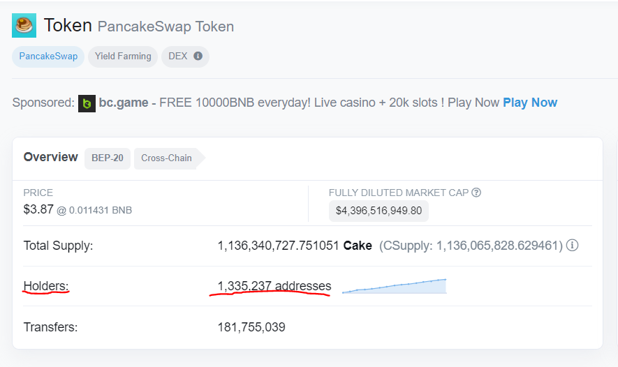
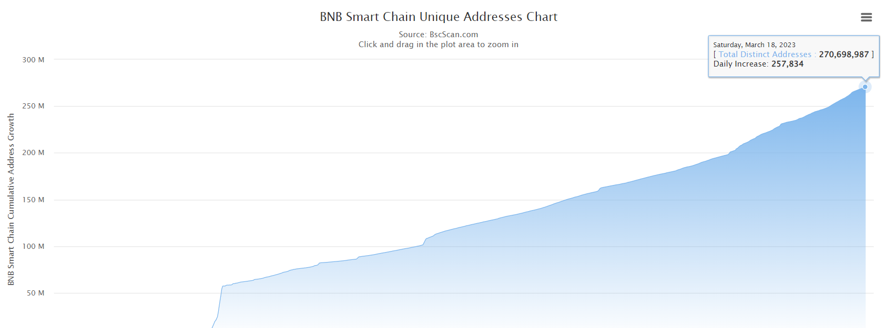
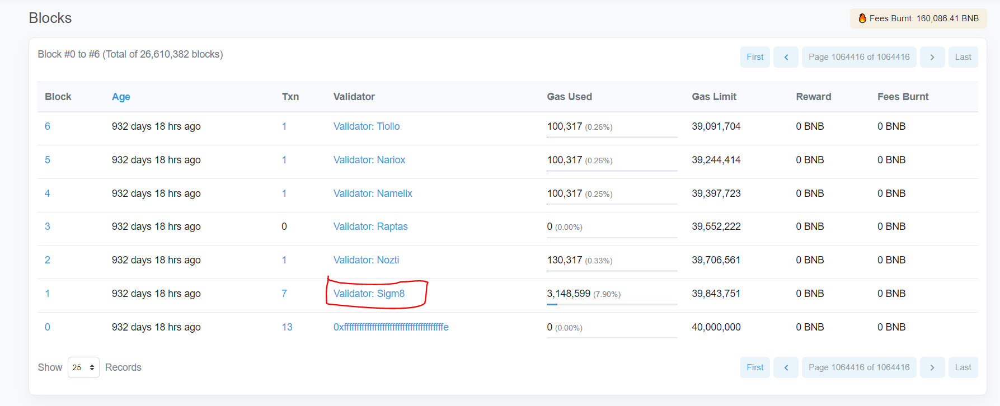
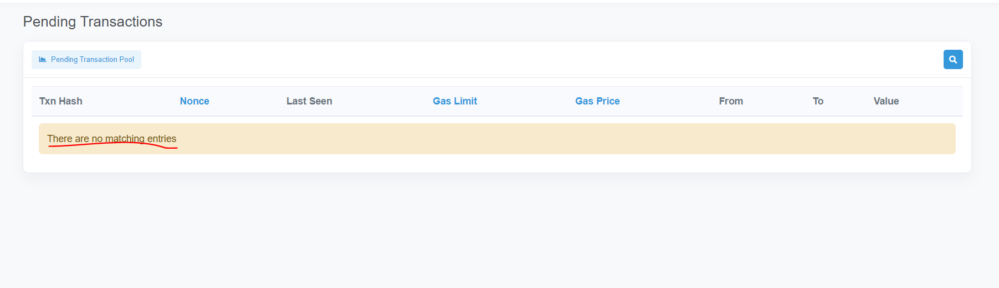
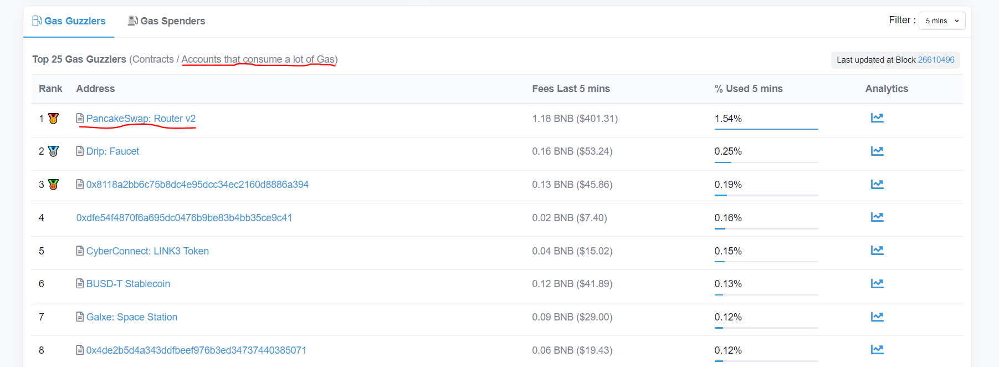
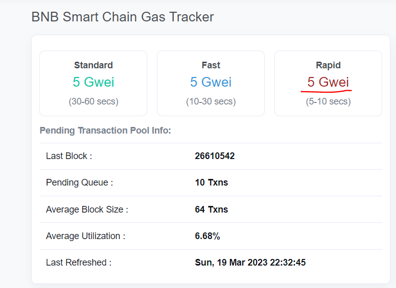
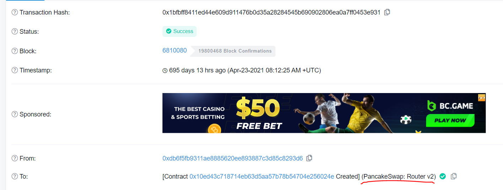

# HW 2

## Author

Cem

## Block Explorer
Use the main net block explorer to find:

1. How many users are holding the pancake swap token 'cake'?

2. Approximately, how many unique addresses are there?

3. Who validated the first block after the genesis block?

4. Roughly how many transactions are pending?

5. Which contract is consuming most gas ?

6. How much gas is needed to have a transaction get in a block within 5–10s?

7. What is special about this transaction 0x1bfbff8411ed44e609d911476b0d35a28284545b690902806ea0a7ff0453e931

